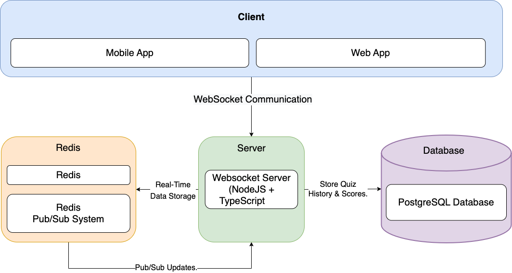

# Real-Time Quiz System

This document describes the architecture, components, data flow, and technologies involved in building a real-time quiz feature for an English learning application.

## 1. Architecture Diagram

Below is an architecture diagram illustrating how the components of the system interact.

## 2. Component Descriptions

1. **Client Application (Web/Mobile)**

   - **Role:** The client interface allows users to join quiz sessions, submit answers, and view the leaderboard.
   - **Responsibilities:** Display quiz questions and user interface elements. Connect to the backend via WebSocket for real-time updates. Render the leaderboard and history of user responses.

2. **WebSocket Server (Backend with Node.js + TypeScript)**

   - **Role:** The backend manages WebSocket connections, processes answer submissions, calculates scores, and broadcasts updates to all clients.
   - **Responsibilities:** Maintain quiz sessions and WebSocket connections. Store and update user scores in Redis. Emit leaderboard and answer history updates to all connected users.

3. **Redis Database (In-Memory Data Store)**

   - **Role:** Redis handles real-time storage of quiz sessions, user scores, and broadcasts updates using its Pub/Sub mechanism.
   - **Why Redis?:** Ultra-fast read/write operations. Efficient Pub/Sub messaging for real-time communication.

4. **PostgreSQL Database (Relational Database)**

   - **Role:** Used for persistent storage of quizzes, user information, and answer history for future analytics.
   - **Why PostgreSQL?:** SQL compliance, ACID transactions, and scalability for long-term data storage.

5. **Redis Pub/Sub System (Message Broker)**
   - **Role:** Redis Pub/Sub handles leaderboard synchronization between multiple instances of the WebSocket server, ensuring all connected users receive real-time updates.

## 3. Data Flow

**Step-by-Step Data Flow Process**

1. **User Joins Quiz Session:**
   - User submits a quizId and username through the client interface.
   - The client connects to the WebSocket server and joins the specific quiz room (using socket.join).
2. **Backend Stores User Data:**
   - The backend adds the user's entry into the leaderboard and initializes their score.
   - If the quiz session doesn't exist yet, it is created in Redis.
3. **User Submits Answer:**
   - The client emits a submitAnswer event with the quizId and answer.
   - The backend processes the answer, updates the score, and logs the answer history in Redis and PostgreSQL.
4. **Leaderboard Update:**
   - The backend emits a leaderboardUpdate event to the quiz room via WebSocket.
   - Redis also uses Pub/Sub to sync updates across servers (if multiple backend instances are running).
5. **Client Receives Leaderboard and History Updates:**
   - The leaderboard and answer history are rendered in real-time on the client interface for all users in the same quiz session.

## 4. Technologies and Tools

| Component              | Technology                     | Justification                                                                     |
| ---------------------- | ------------------------------ | --------------------------------------------------------------------------------- |
| Frontend (Client)      | React / React Native / Flutter | Simple, reusable components; ideal for building interactive quiz UIs.             |
| Backend                | Node.js + TypeScript           | Non-blocking I/O with WebSocket support; TypeScript ensures type safety.          |
| Database (Relational)  | PostgreSQL                     | SQL-compliant, scalable database for long-term quiz and user data storage.        |
| In-Memory Store        | Redis                          | Ultra-fast operations, Pub/Sub support for real-time leaderboard synchronization. |
| Communication Protocol | WebSocket                      | Full-duplex communication, ideal for real-time updates.                           |
| Hosting                | AWS / Heroku / Vercel          | Supports auto-scaling and handles WebSocket traffic efficiently.                  |

## 5. Video Demo

## Conclusion

This system is designed to handle real-time, multi-user quiz participation with a scalable architecture. Redis ensures fast operations, while PostgreSQL stores long-term data. The combination of WebSocket communication, Redis Pub/Sub, and in-memory caching ensures high performance even under heavy load.
